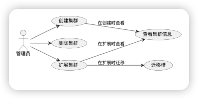
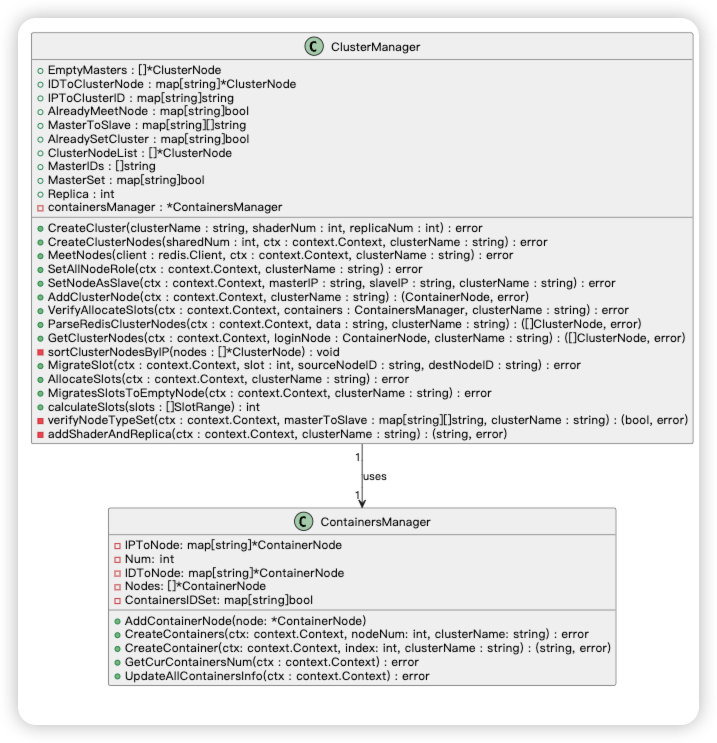
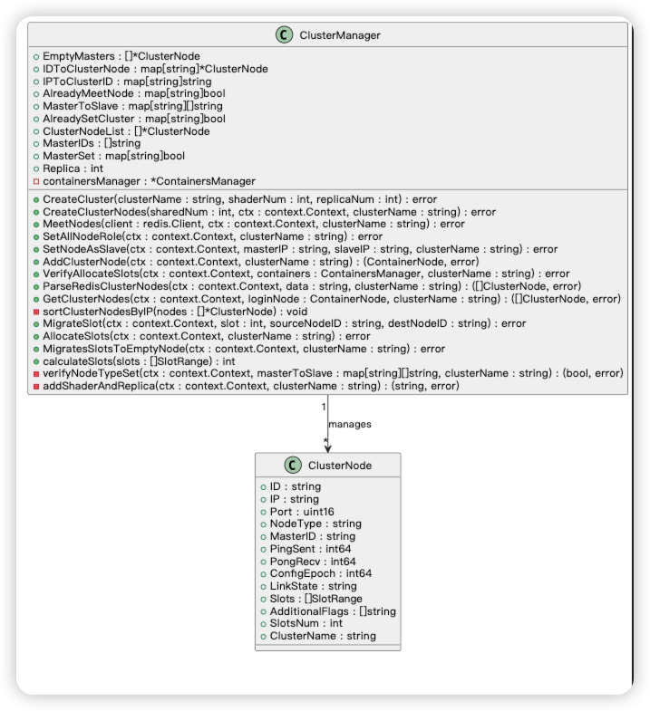
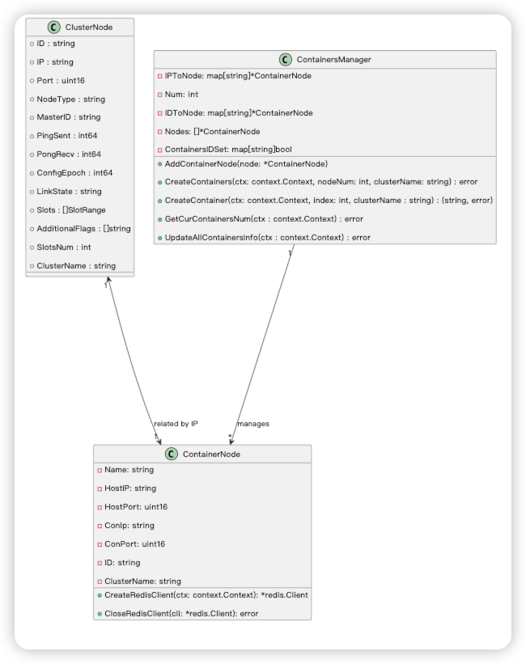

## 项目结构
```
redisStudy
├─ Design.md
├─ README.md
├─ cluster
├─ cmd
│  ├─ create.go
│  ├─ delete.go
│  ├─ root.go
│  └─ scale.go
├─ config
│  ├─ conf.json
│  └─ readConf_test.go
├─ go.mod
├─ go.sum
├─ main.go
├─ model
│  ├─ cluster_manager.go
│  ├─ cluster_node.go
│  ├─ cluster_node_test.go
│  ├─ config.go
│  ├─ config_test.go
│  ├─ containers_manger.go
│  ├─ create_cluster.go
│  ├─ create_cluster_test.go
│  ├─ delete_cluster.go
│  ├─ delete_cluster_test.go
│  ├─ redis_cluster_config.json
│  ├─ scale_cluster.go
│  └─ scale_cluster_test.go
├─ redis_cluster_config.json
└─ utils
   ├─ uils_test.go
   └─ utils.go
```
用例图



主要类关系





[//]: # (```plantuml)

[//]: # ()
[//]: # (@startuml)

[//]: # ()
[//]: # (!define RECTANGLE class)

[//]: # ()
[//]: # ()
[//]: # (RECTANGLE ClusterNode {)

[//]: # ()
[//]: # (  + ID : string                     )

[//]: # ()
[//]: # (  + IP : string                      )

[//]: # ()
[//]: # (  + Port : uint16                    )

[//]: # ()
[//]: # (  + NodeType : string                )

[//]: # ()
[//]: # (  + MasterID : string                )

[//]: # ()
[//]: # (  + PingSent : int64                )

[//]: # ()
[//]: # (  + PongRecv : int64                 )

[//]: # ()
[//]: # (  + ConfigEpoch : int64             )

[//]: # ()
[//]: # (  + LinkState : string               )

[//]: # ()
[//]: # (  + Slots : []SlotRange              )

[//]: # ()
[//]: # (  + AdditionalFlags : []string       )

[//]: # ()
[//]: # (  + SlotsNum : int                    )

[//]: # ()
[//]: # (  + ClusterName : string             )

[//]: # ()
[//]: # (})

[//]: # ()
[//]: # ()
[//]: # (RECTANGLE ClusterManager {)

[//]: # ()
[//]: # (  + EmptyMasters : []*ClusterNode)

[//]: # ()
[//]: # (  + IDToClusterNode : map[string]*ClusterNode)

[//]: # ()
[//]: # (  + IPToClusterID : map[string]string)

[//]: # ()
[//]: # (  + AlreadyMeetNode : map[string]bool)

[//]: # ()
[//]: # (  + MasterToSlave : map[string][]string)

[//]: # ()
[//]: # (  + AlreadySetCluster : map[string]bool)

[//]: # ()
[//]: # (  + ClusterNodeList : []*ClusterNode)

[//]: # ()
[//]: # (  + MasterIDs : []string)

[//]: # ()
[//]: # (  + MasterSet : map[string]bool)

[//]: # ()
[//]: # (  + Replica : int)

[//]: # ()
[//]: # (  - containersManager : *ContainersManager)

[//]: # ()
[//]: # ()
[//]: # (  + CreateCluster&#40;clusterName : string, shaderNum : int, replicaNum : int&#41; : error)

[//]: # ()
[//]: # (  + CreateClusterNodes&#40;sharedNum : int, ctx : context.Context, clusterName : string&#41; : error)

[//]: # ()
[//]: # (  + MeetNodes&#40;client : redis.Client, ctx : context.Context, clusterName : string&#41; : error)

[//]: # ()
[//]: # (  + SetAllNodeRole&#40;ctx : context.Context, clusterName : string&#41; : error)

[//]: # ()
[//]: # (  + SetNodeAsSlave&#40;ctx : context.Context, masterIP : string, slaveIP : string, clusterName : string&#41; : error)

[//]: # ()
[//]: # (  + AddClusterNode&#40;ctx : context.Context, clusterName : string&#41; : &#40;ContainerNode, error&#41;)

[//]: # ()
[//]: # (  + VerifyAllocateSlots&#40;ctx : context.Context, containers : ContainersManager, clusterName : string&#41; : error)

[//]: # ()
[//]: # (  + ParseRedisClusterNodes&#40;ctx : context.Context, data : string, clusterName : string&#41; : &#40;[]ClusterNode, error&#41;)

[//]: # ()
[//]: # (  + GetClusterNodes&#40;ctx : context.Context, loginNode : ContainerNode, clusterName : string&#41; : &#40;[]ClusterNode, error&#41;)

[//]: # ()
[//]: # (  - sortClusterNodesByIP&#40;nodes : []*ClusterNode&#41; : void)

[//]: # ()
[//]: # (  + MigrateSlot&#40;ctx : context.Context, slot : int, sourceNodeID : string, destNodeID : string&#41; : error)

[//]: # ()
[//]: # (  + AllocateSlots&#40;ctx : context.Context, clusterName : string&#41; : error)

[//]: # ()
[//]: # (  + MigratesSlotsToEmptyNode&#40;ctx : context.Context, clusterName : string&#41; : error)

[//]: # ()
[//]: # (  + calculateSlots&#40;slots : []SlotRange&#41; : int)

[//]: # ()
[//]: # (  - verifyNodeTypeSet&#40;ctx : context.Context, masterToSlave : map[string][]string, clusterName : string&#41; : &#40;bool, error&#41;)

[//]: # ()
[//]: # (  - addShaderAndReplica&#40;ctx : context.Context, clusterName : string&#41; : &#40;string, error&#41;)

[//]: # ()
[//]: # (})

[//]: # ()
[//]: # ()
[//]: # (RECTANGLE ContainerNode {)

[//]: # ()
[//]: # (  - Name: string)

[//]: # ()
[//]: # (  - HostIP: string)

[//]: # ()
[//]: # (  - HostPort: uint16)

[//]: # ()
[//]: # (  - ConIp: string)

[//]: # ()
[//]: # (  - ConPort: uint16)

[//]: # ()
[//]: # (  - ID: string)

[//]: # ()
[//]: # (  - ClusterName: string)

[//]: # ()
[//]: # ()
[//]: # (  + CreateRedisClient&#40;ctx: context.Context&#41;: *redis.Client)

[//]: # ()
[//]: # (  + CloseRedisClient&#40;cli: *redis.Client&#41;: error)

[//]: # ()
[//]: # (})

[//]: # ()
[//]: # ()
[//]: # (RECTANGLE ContainersManager {)

[//]: # ()
[//]: # (  - IPToNode: map[string]*ContainerNode)

[//]: # ()
[//]: # (  - Num: int)

[//]: # ()
[//]: # (  - IDToNode: map[string]*ContainerNode)

[//]: # ()
[//]: # (  - Nodes: []*ContainerNode)

[//]: # ()
[//]: # (  - ContainersIDSet: map[string]bool)

[//]: # ()
[//]: # ()
[//]: # (  + AddContainerNode&#40;node: *ContainerNode&#41;)

[//]: # ()
[//]: # (  + CreateContainers&#40;ctx: context.Context, nodeNum: int, clusterName: string&#41; : error)

[//]: # ()
[//]: # (  + CreateContainer&#40;ctx: context.Context, index: int, clusterName : string&#41; : &#40;string, error&#41;)

[//]: # ()
[//]: # (  + GetCurContainersNum&#40;ctx : context.Context&#41; : error)

[//]: # ()
[//]: # (  + UpdateAllContainersInfo&#40;ctx : context.Context&#41; : error)

[//]: # ()
[//]: # (})

[//]: # ()
[//]: # ()
[//]: # (RECTANGLE redis {)

[//]: # ()
[//]: # (  + NewClient&#40;options : *Options&#41; : *Client)

[//]: # ()
[//]: # (  + Ping&#40;ctx : context.Context&#41; : *Result)

[//]: # ()
[//]: # (})

[//]: # ()
[//]: # ()
[//]: # (' ClusterManager"1" -->"1" ContainersManager : uses)

[//]: # ()
[//]: # ('  ClusterManager"1" --> "*"ClusterNode : manages)

[//]: # ()
[//]: # ( ClusterNode "1" <--> "1"ContainerNode : related by IP)

[//]: # ()
[//]: # (' ContainerNode "1"-->"1" redis : uses)

[//]: # ()
[//]: # ( ContainersManager "1" --> "*" ContainerNode : manages)

[//]: # ()
[//]: # ()
[//]: # (@enduml)

[//]: # ()
[//]: # (```)

[//]: # ()
[//]: # (```plantuml)

[//]: # (@startuml)

[//]: # (left to right direction)

[//]: # ()
[//]: # (actor 管理员)

[//]: # ()
[//]: # (usecase "创建集群" as UC1)

[//]: # (usecase "删除集群" as UC2)

[//]: # (usecase "扩展集群" as UC3)

[//]: # (usecase "查看集群信息" as UC4)

[//]: # (usecase "迁移槽" as UC5)

[//]: # ()
[//]: # (管理员 --> UC1)

[//]: # (管理员 --> UC2)

[//]: # (管理员 --> UC3)

[//]: # ()
[//]: # (UC1 --> UC4 : 在创建时查看)

[//]: # (UC3 --> UC4 : 在扩展时查看)

[//]: # (UC3 --> UC5 : 在扩展时迁移)

[//]: # ()
[//]: # (@enduml)

[//]: # (```)

[//]: # ()


## 创建集群流程
需要的参数： 所需shard数量，


// 扩容集群的流程
// 删除集群的流程