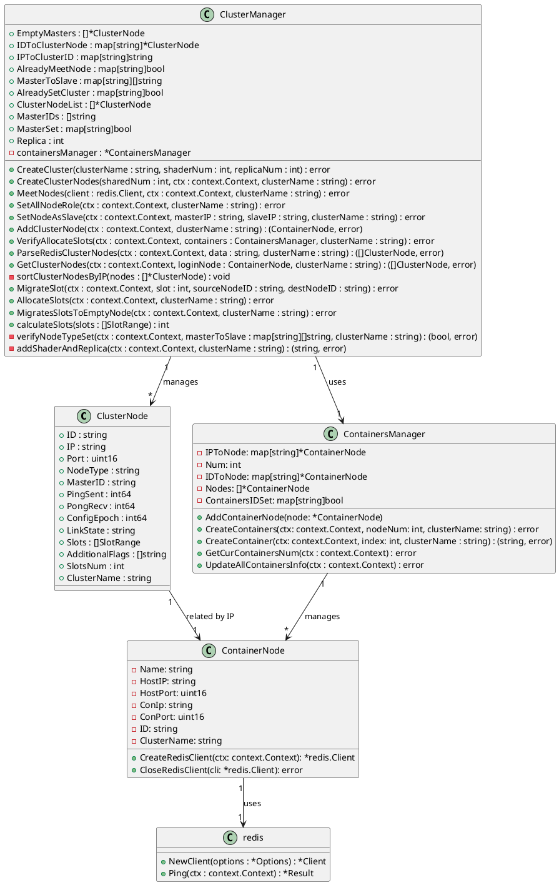

## 项目结构
```
redisStudy
├─ Design.md
├─ README.md
├─ cluster
├─ cmd
│  ├─ create.go
│  ├─ delete.go
│  ├─ root.go
│  └─ scale.go
├─ config
│  ├─ conf.json
│  └─ readConf_test.go
├─ go.mod
├─ go.sum
├─ main.go
├─ model
│  ├─ cluster_manager.go
│  ├─ cluster_node.go
│  ├─ cluster_node_test.go
│  ├─ config.go
│  ├─ config_test.go
│  ├─ containers_manger.go
│  ├─ create_cluster.go
│  ├─ create_cluster_test.go
│  ├─ delete_cluster.go
│  ├─ delete_cluster_test.go
│  ├─ redis_cluster_config.json
│  ├─ scale_cluster.go
│  └─ scale_cluster_test.go
├─ redis_cluster_config.json
└─ utils
   ├─ uils_test.go
   └─ utils.go
```

主要类关系



