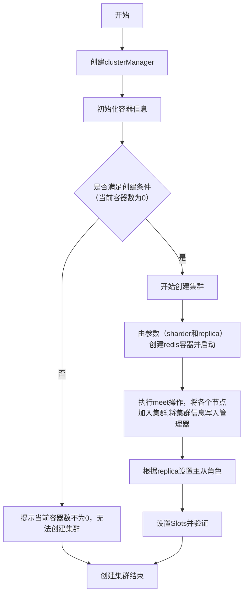

## 项目结构
```
redisStudy
├─ cluster
├─ cmd
│  ├─ create.go
│  ├─ delete.go
│  ├─ root.go
│  └─ scale.go
├─ go.mod
├─ go.sum
├─ main.go
├─ model
│  ├─ cluster_manager.go
│  ├─ cluster_node.go
│  ├─ cluster_node_test.go
│  ├─ config.go
│  ├─ containers_manger.go
│  ├─ create_cluster.go
│  ├─ create_cluster_test.go
│  ├─ delete_cluster.go
│  ├─ delete_cluster_test.go
│  ├─ scale_cluster.go
│  └─ scale_cluster_test.go
├─ utils
│  └─ utils.go
└─ 项目说明.md

```


删除


