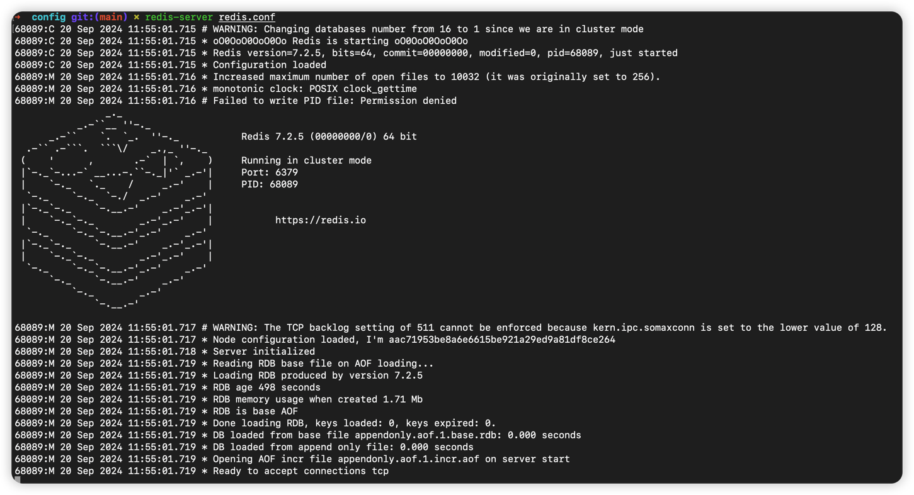
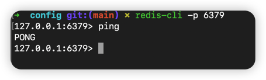
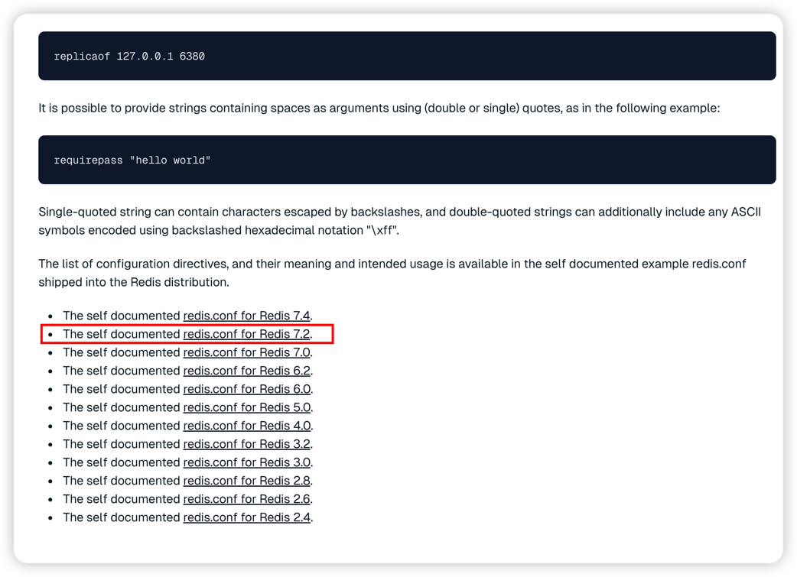
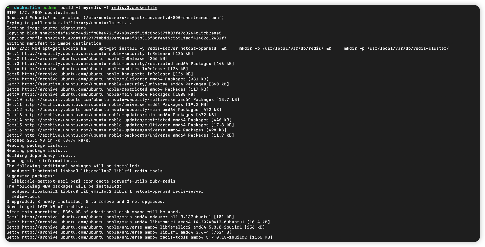

## 项目介绍
此项目实现了对单个集群的创建删除，以及集群的扩容。

## 环境配置
### 1. 下载podman
- 安装 Homebrew（如果尚未安装）：

参考博客：https://www.cnblogs.com/liyihua/p/12753163.html
- 安装 Podman：
使用 Homebrew 安装 Podman：
~~~
brew install podman
~~~
- 安装 Podman Desktop（可选）：
Podman Desktop 是一个图形界面的管理工具，可以使 Podman 的使用更加方便。要安装它，请运行：
~~~
brew install --cask podman-desktop
~~~

- 启动 Podman：
安装完成后，启动 Podman。运行：
~~~
podman --version
~~~
显示 Podman 的版本，确认成功安装。
- 初始化并启动Podman
~~~
podman machine init
podman machine start
~~~

### 2. 下载Redis并修改配置确保redis cluster 可以正常启动
#### Step1  下载redis
~~~
brew install redis
~~~
#### step2 启动redis
```shell
redis-server
```
结果如下：

#### Step3 测试Redis 是否安装成功
```
redis-cli -p <port> -h <ip>
```
检测连接：

#### Step4 配置redis.conf
redis.conf 文件在当前目录下可以找到，./prepareFiles/redis/config/redis.conf
若需要重新下载：
下载版本为7.2的配置文件
[redis配置下载](https://redis.io/docs/latest/operate/oss_and_stack/management/config/)

修改配置文件，添加如下内容
~~~
cluster_enabled=yes，cluster_config_file=nodes.conf，cluster_node_timeout=5000，cluster_require_full_coverage=yes，cluster_replica_validity_factor=10，cluster_migration_barrier=1，cluster_slave_no_failover=yes，cluster_slave_validity_factor=10，cluster_slave_no_failover=yes，cluster_slave_no_failover=yes，cluster_slave_no_failover=yes，cluster_slave_no_failover=yes，
~~~

### 3. 编写dockerfile 使用Podman build
```Dockerfile
# # 使用 redis:alpine 作为基础镜像
# FROM redis:alpine

# # 更新 apk 包索引并安装 bash
# RUN apk update && apk add --no-cache bash && mkdir -p /usr/local/var/db/redis/
# # 复制 Redis 配置文件到容器中（可选，根据需要）
# COPY redis.conf /usr/local/etc/redis/redis.conf

# # 设置容器启动时的默认命令
# CMD ["redis-server"]

# 使用 Ubuntu 作为基础镜像
FROM ubuntu:latest

# 更新包索引并安装 Redis
RUN apt-get update && \
    apt-get install -y redis-server netcat-openbsd  && \
    mkdir -p /usr/local/var/db/redis/ && \
    mkdir -p /usr/local/var/db/redis-cluster/
    
```
- 使用podman build 构建镜像
方法一：直接运行根目录下的build_image.sh
方法二：在根目录下执行如下命令

```
podman build -t <imagename> -f <dockerfilepath>
```
正确运行结果：



### 4. 使用 go mod install 下载所需的包
```shell
go mod install
```
### 5. 编译项目
```
go build -o cluster
```
编译完成后在根目录会出现如下文件：

## 使用说明 
### 创建集群
```shell
./cluster create -s <shaderNum> -r <replicaNum> -n <clusterName> -p <port>
```
参数解释：
- s: shaderNum, 集群中shader节点的数量，默认为3
- r: relicaNum, 集群中relica节点的数量，默认为2
- n: clusterName, 集群的名称，默认为cluster

**example** :
~~~
./cluster create -s 3 -r 2 -n test -p
~~~
正确运行结果：

### 删除集群
```shell
./cluster delete -n <clusterName>
```
参数解释：
- n: clusterName, 集群的名称，必须显式声明

**example**
~~~
./cluster delete -n <clusterName>
~~~
正确运行结果：


### 扩容集群

```shell
./scale -n <clusterName> -s <shaderNum> 
```
参数解释：
- n: clusterName, 集群的名称，必须显式声明
- s: shaderNum, 增加集群中shader节点的数量，默认为1

**example:**
~~~
./scale -n test -s 3 
~~~
正确运行结果：

