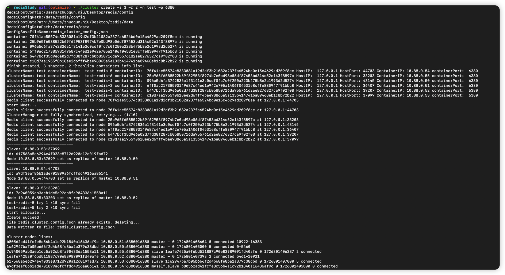
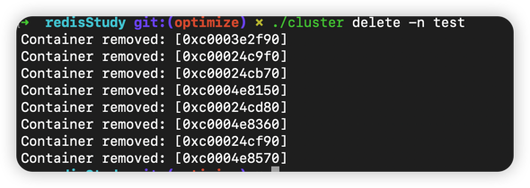
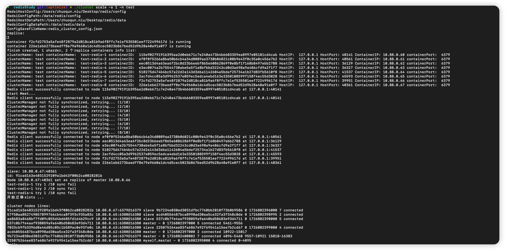

## 项目介绍
此项目在MacOS开发环境下实现了对单个集群的创建、删除以及扩容功能。
## 使用说明 
### 创建集群
```shell
./cluster create -s <shaderNum> -r <replicaNum> -n <clusterName> -p <port>
```
参数解释：
- s: shaderNum, 集群中shader节点的数量，默认为3
- r: relicaNum, 集群中relica节点的数量，默认为2
- n: clusterName, 集群的名称，默认为cluster

**Example** :
~~~
./cluster create -s 3 -r 2 -n test -p
~~~
正确运行结果：


### 删除集群
```shell
./cluster delete -n <clusterName>
```
参数解释：
- n: clusterName, 集群的名称，必须显式声明

**Example**
~~~
./cluster delete -n <clusterName>
~~~
正确运行结果：


### 扩容集群

```shell
./cluster scale -n <clusterName> -s <shaderNum> 
```
参数解释：
- n: clusterName, 集群的名称，必须显式声明
- s: shaderNum, 增加集群中shader节点的数量，默认为1

**Example:**
~~~
./cluster scale -n test -s 3 
~~~
正确运行结果：

